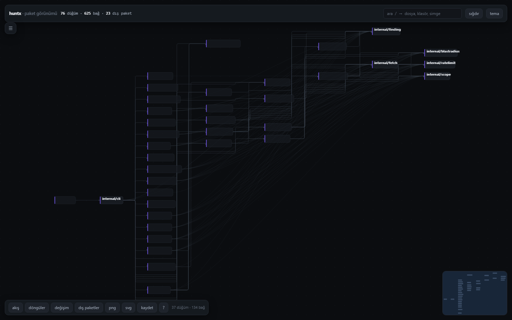
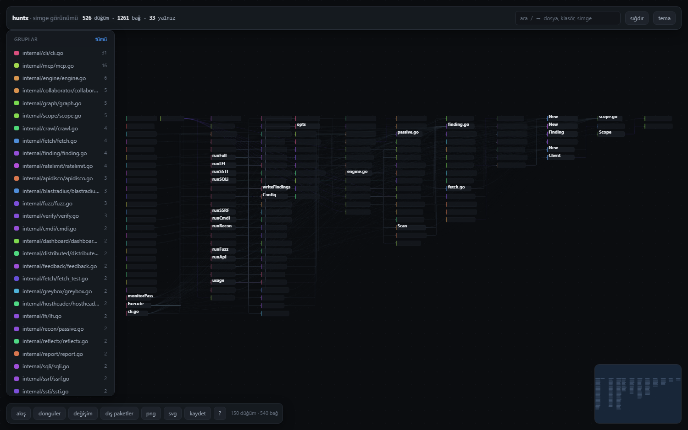
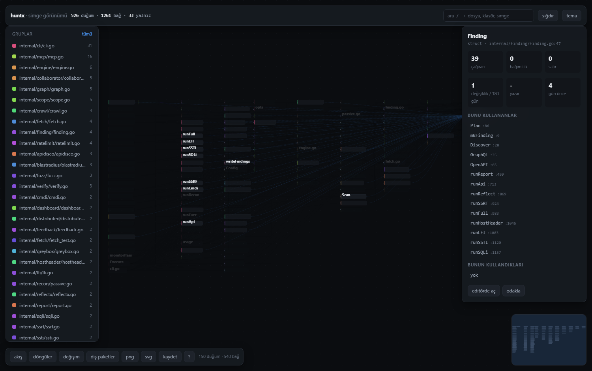
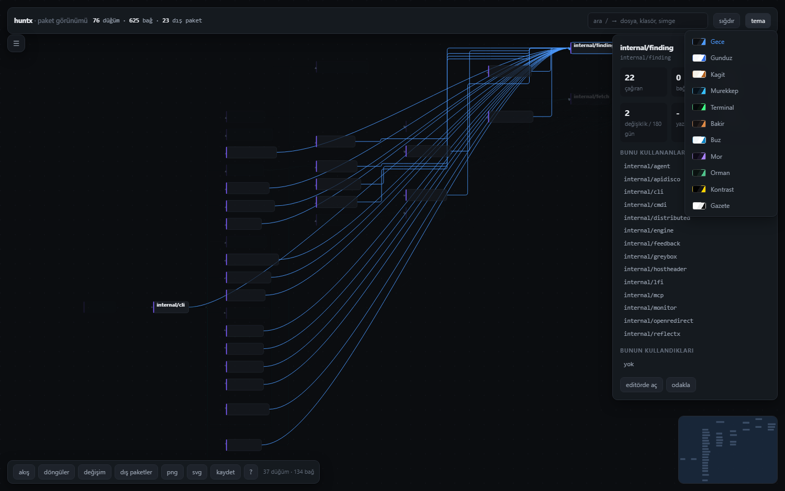

# talk-graph

[](https://github.com/Talkdedsec/talk-graph/actions/workflows/ci.yml)

[English](README.md) · **Türkçe**

Kod tabanını gezilebilir, tek dosyalık bir mimari haritaya çevirir. Elle diyagram yazmak yok:
girdi deponun kendisi.

```bash
node bin/tg.mjs C:\yol\projem
```

Üretilen `cikti/projem.html` tek başına çalışan tek dosyadır — dış bağımlılık yok, CDN yok,
derleme adımı yok. Olduğu gibi paylaşılır.



## Neden

Diyagram araçları diyagramı sana yazdırır. Bu onu okur. Her düğüm gerçek bir dosya ya da paket,
her kenar gerçek bir dosyaya çözülmüş gerçek bir import, ve her düğüm geldiği kod satırına
geri bağlanır.



## Üç seviye

| seviye | düğüm | kenar |
|---|---|---|
| `--gorunum grup` | paket / klasör | aralarındaki import |
| `--gorunum dosya` | dosya | çözülmüş import |
| `--gorunum simge` | fonksiyon, sınıf, tip | çağrı ya da kullanım, onu doğuran satırla |

Simge seviyesi adlandırılmış import'ları ve nitelikli çağrıları (`scope.Load()`, `pkg::fn()`)
işaret ettikleri simgeye çözer: düğüm bir fonksiyon, metot ya da tip, kenar bir çağrıdır. Grup
kutuları dosyaya döner. Simgeye tıklamak dosyayı kendi satırında açar.

| kenar | anlamı |
|---|---|
| `cagri` | bir simge diğerini çağırıyor |
| `referans` | çağırmadan adını geçiriyor |
| `metot` | aynı paket içinde çözülen çağrı |
| `icerir` | tip kendi metodunu içeriyor |

TypeScript/JavaScript, Python, Go, Rust, C# ve Java'yı kapsar. 76 dosyalık Go deposunda 547
simge ve 1261 kenar çıkarıyor; en bağlı düğüm olarak bildirdikleri, bir insanın elle sayacağı
isimler: `finding.Finding`, `cli.Execute`, `fetch.Client`, `scope.Scope`.

## Kurulum

Node 20 ve üstü. Başka bir şey gerekmez.

```bash
git clone git@github.com:Talkdedsec/talk-graph.git
cd talk-graph
node --test
```

CLI'yi `tg` olarak bağlamak istersen:

```bash
npm link
tg ./projem
```

## Komutlar

```
tg <yol>                         haritayı üret ve aç
tg ciz <yol> [seçenekler]        harita üret
tg tara <yol> --cikti g.json     ham grafı kaydet
tg anlat <yol> <arama>           bir düğümü açıkla: rol, çağıranlar, bağımlılıklar
tg yol <yol> <a> <b>             iki düğüm arasındaki en kısa zincir
tg denetle <yol>                 sağlık raporu: döngüler, tanrı düğümler, riskli dosyalar
tg kume <yol>                    bağlantıya göre topluluk bul, klasörlerle karşılaştır
tg disaaktar <yol> --bicim dot   dot | graphml | csv | mermaid | json
tg fark <eski.json> <yeni.json>  iki tarama arasındaki değişim
tg izle <yol>                    dosya değiştikçe haritayı tazele
```

### Çözümleme komutları neyi yanıtlar

```bash
tg anlat ./api siparis.ts      # bunu kim çağırıyor, bu neyi çekiyor, döngüde mi
tg yol ./api route.ts db.ts    # ikisini bağlayan import zinciri, satır numaralarıyla
tg denetle ./api               # döngüler, aşırı bağlı düğümler, hem değişen hem bağımlı dosyalar
tg kume ./api                  # kodun gerçekte sahip olduğu modüller, iddia ettiği klasörlere karşı
```

## Seçenekler

| bayrak | işi |
|---|---|
| `--gorunum grup\|dosya\|simge` | paket (varsayılan), dosya ya da simge seviyesi |
| `--hepsi` | simge görünümünde bağsız simgeleri de çiz |
| `--derinlik <n>` | grup yolu derinliği (varsayılan 2) |
| `--gruplama klasor\|topluluk` | klasöre göre grupla, ya da kodun gerçekten bağladığına göre |
| `--tema <ad>` | açılış teması, bkz. [Temalar](docs/TEMALAR.md) |
| `--odak <yol parçası>` | yalnız o düğümün komşuluğunu çiz |
| `--cevre <n>` | odak yarıçapı (varsayılan 1) |
| `--enfazla <n>` | çizilecek en fazla düğüm (varsayılan 120) |
| `--yon sag\|asagi` | akış yönü |
| `--dis` | dış paketleri de çiz (varsayılan dışarıda) |
| `--testyok` | test dosyalarını dışla |
| `--gun <n>` | git geçmişi penceresi, gün (varsayılan 180) |
| `--gecmisyok` | git geçmişi katmanını okuma |
| `--konum <dosya>` | kaydedilmiş düğüm konumlarını geri yükle |
| `--cikti <dosya>` | çıktı yolu |

## Haritada

| hareket | sonuç |
|---|---|
| sürükle / tekerlek | gezinme ve yakınlaştırma |
| `f` | ekrana sığdır |
| `/` | dosya, klasör ve simge araması |
| `t` / `Shift+t` | sonraki / önceki tema (11 tane) |
| `a` | akış animasyonu |
| düğüme tıkla | çağıranlar, bağımlılıklar, dışa açılan simgeler |
| `editörde aç` | dosyayı VS Code'da açar |
| düğümü sürükle | taşı; `kaydet` konumları dışa aktarır, `--konum` geri yükler |
| `döngüler` | dairesel bağımlılıkları izole eder |
| `değişim` | düğümleri git değişiklik sayısına göre renklendirir |
| `png` / `svg` | haritayı dışa aktarır |
| `g` | grup / bağ türü filtre paneli |
| `1` · `2` · `3` | yakınlaştır · uzaklaştır · sığdır |
| `c` | dairesel bağımlılıkları izole et |
| `?` | kısayol listesi |
| kenarın üstüne gel | kaynak → hedef ve onu doğuran satır |

Her düğüm ait olduğu grubun rengini taşır, soldaki panel o grupları sayılarıyla listeler ve
tek tek kapatır, araç çubuğundaki sayaç ekranda ne kaldığını söyler. Uzaklaştırdığında yalnız
işaret taşları etiketini korur.





## Diller

TypeScript/JavaScript (`tsconfig` takma adları dahil), Python, Go (`go.mod` modül yolu),
Rust (`crate::` ve `mod`), C# (namespace dizini), Lua, Ruby, PHP, Java.

Çözülemeyen import'lar atılmaz, dış paket düğümü olur.

## Nasıl çalışır

| aşama | dosya | işi |
|---|---|---|
| tarama | `cekirdek/tarama.mjs` | dosyaları gezer, dile göre import ve simge çıkarır, hedefi gerçek dosyaya çözer |
| model | `cekirdek/graf.mjs` | fan-in/out, döngü (Tarjan), klasör gruplama, budama, tarama farkı |
| geçmiş | `cekirdek/gecmis.mjs` | `git log`'dan dosya başına değişiklik sayısı, son dokunma, yazar sayısı |
| yerleşim | `cekirdek/yerlesim.mjs` | katmanlı yerleşim: döngü kırma, katman atama, medyan sıralama, koordinat ataması, ortogonal yönlendirme |
| çözümleme | `cekirdek/analiz.mjs` | düğüm arama, açıklama, en kısa yol, sağlık raporu, modülerlik kümeleme |
| dışa aktarma | `cekirdek/disaaktar.mjs` | dot, graphml, csv, mermaid, json |
| çizim | `cekirdek/cizim.mjs` + `kanvas/` | gömülü SVG sahnesi ve gezgini olan tek dosyalık HTML |

Uzun kenarlar sanal düğüm zincirine girmez, eğri olarak çizilir; kesişmeyi düşük tutan şey bu:
76 dosyalık Go deposunda paket haritası 42 ms'de 61 kesişmeye iniyor.

## Ölçüm

| depo | dosya | bağ | çizilen | katman | kesişme | süre |
|---|---|---|---|---|---|---|
| Go, 76 dosya | 76 | 625 | 37 | 8 | 61 | 42 ms |
| Next.js, 193 dosya | 193 | 1039 | 10 | 5 | 24 | 392 ms |

## Belgeler

- [Mimari](docs/MIMARI.md) — hattın nasıl kurulduğu
- [Temalar](docs/TEMALAR.md) — on bir gömülü tema ve yenisini eklemek
- [Değişim defteri](CHANGELOG.md)
- [Katkı](CONTRIBUTING.md)
- [Güvenlik](SECURITY.md)

## Lisans

Özel mülk. Tüm hakları saklıdır — [LICENSE](LICENSE).
