# Themes · Temalar

**EN** — Eleven built-in themes. Pick the starting one with `--tema <name>`, switch inside the map
with the `tema` button or `t` / `Shift+t`. The choice is remembered per browser, and PNG/SVG export
uses whatever theme is on screen.

**TR** — On bir gömülü tema. Açılış temasını `--tema <ad>` seçer, harita içinde `tema` düğmesi ya da
`t` / `Shift+t` değiştirir. Seçim tarayıcı başına hatırlanır; PNG/SVG dışa aktarma ekrandaki temayla
çalışır.

```bash
node bin/tg.mjs ./projem --tema murekkep
```

| | | |
|---|---|---|
| **gece** — default, neutral dark<br>varsayılan, nötr koyu<br>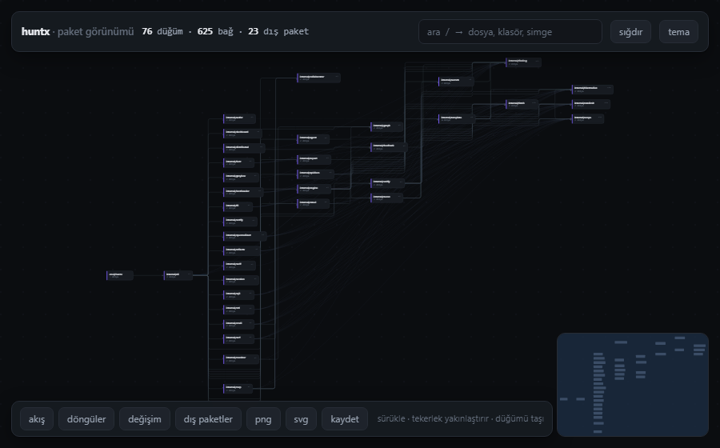 | **gunduz** — neutral light<br>nötr açık<br>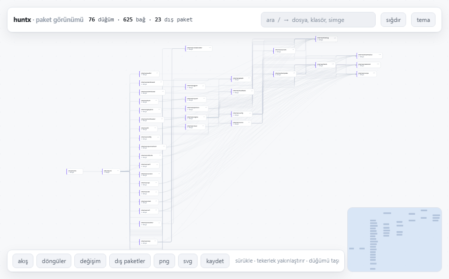 | **kagit** — warm paper<br>sıcak kâğıt<br>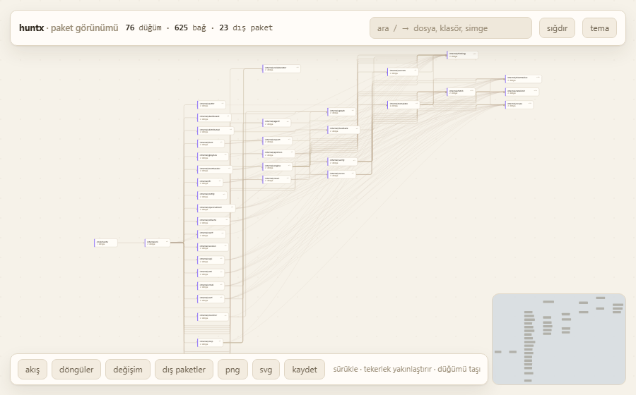 |
| **murekkep** — blueprint blue<br>mavi teknik çizim<br>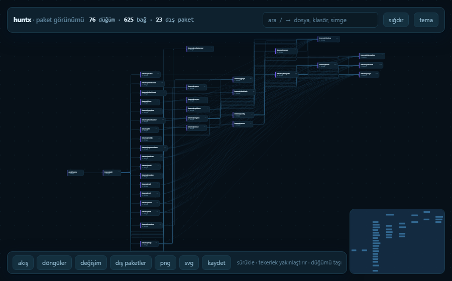 | **terminal** — green phosphor<br>yeşil fosfor<br>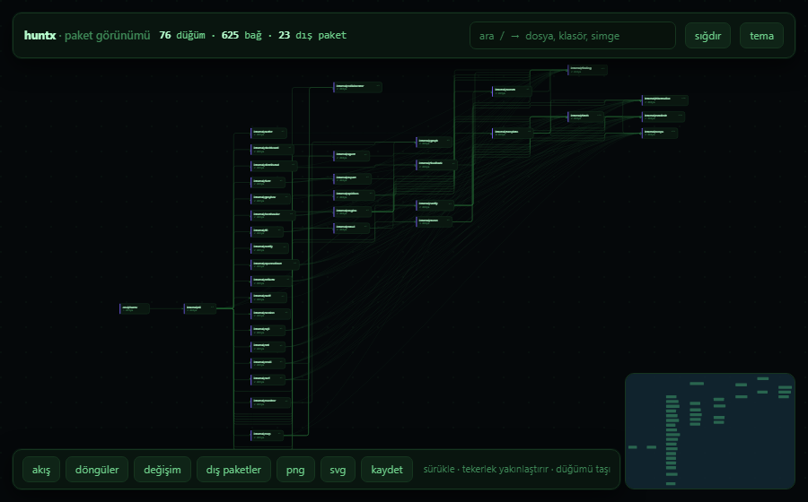 | **bakir** — copper on charcoal<br>kömür üstü bakır<br>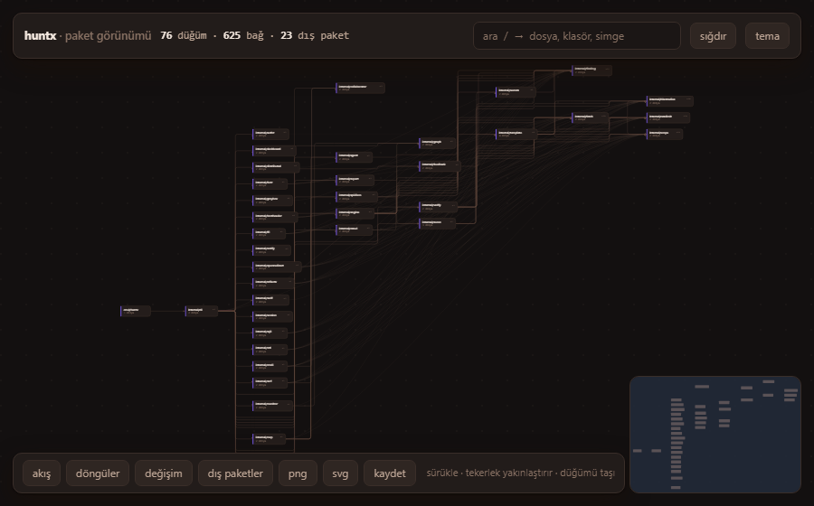 |
| **buz** — cool light<br>serin açık<br>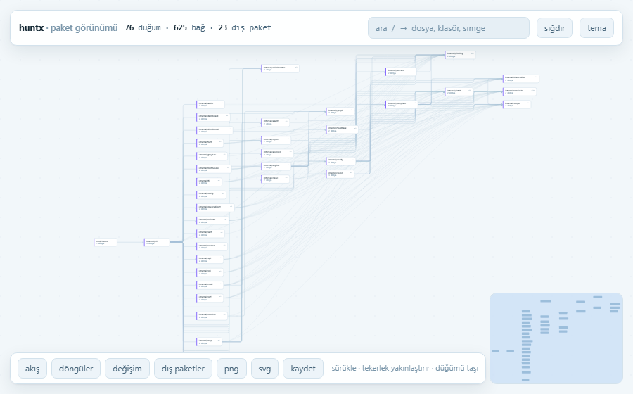 | **mor** — violet dark<br>mor koyu<br>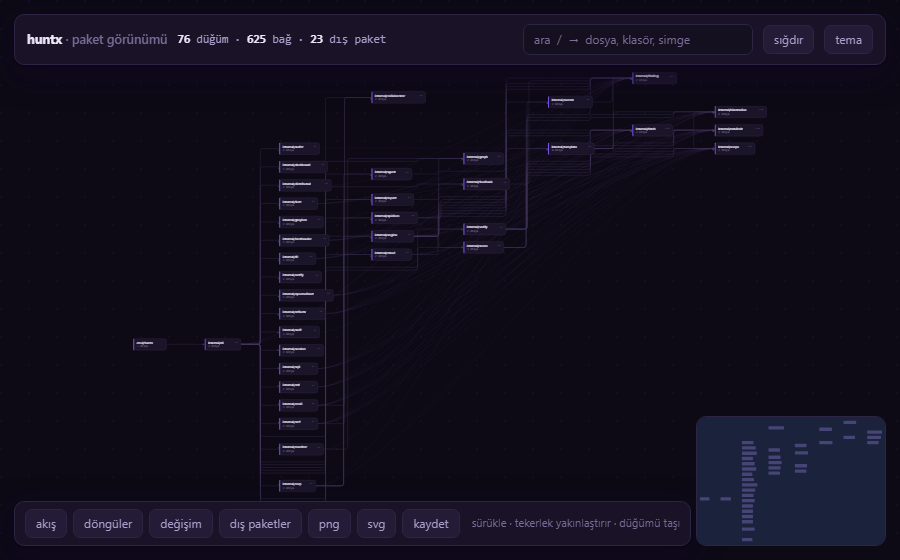 | **orman** — forest dark<br>orman koyu<br>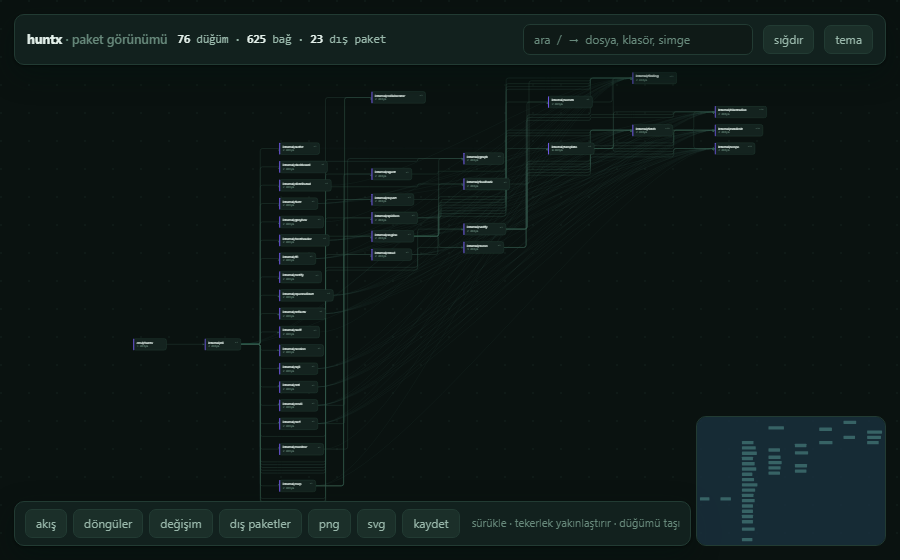 |
| **kontrast** — maximum contrast<br>en yüksek kontrast<br>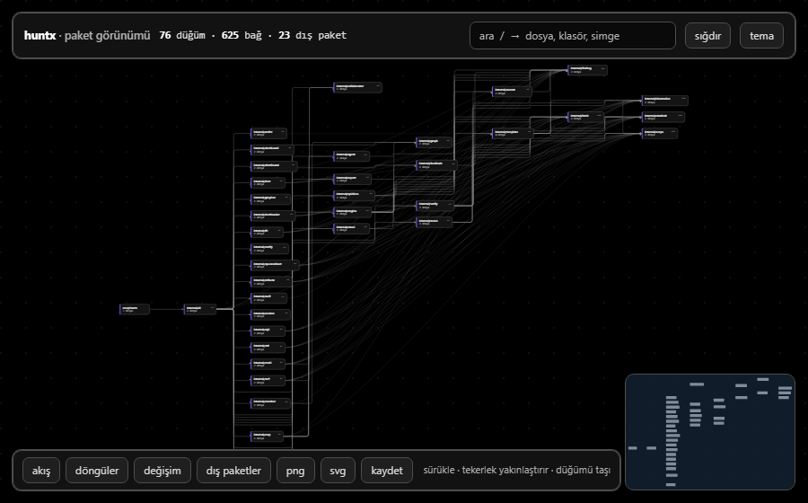 | **gazete** — print, black on white<br>baskı, beyaz üstü siyah<br>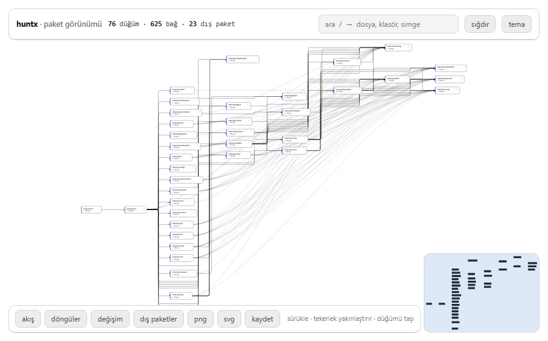 | |

## Adding one · Yeni tema eklemek

**EN** — A theme is one CSS block of tokens. Add it to `kanvas/stil.css` next to the others, add a
row to `TEMALAR` in `kanvas/motor.js`, and add a swatch rule (`.ornek[data-o="ad"]`). Nothing else
reads theme names, and every colour in the map already resolves through these tokens.

**TR** — Tema, tek bir CSS token bloğudur. `kanvas/stil.css` içine diğerlerinin yanına ekle,
`kanvas/motor.js` içindeki `TEMALAR` listesine bir satır ve bir örnek kuralı
(`.ornek[data-o="ad"]`) ekle. Tema adını başka hiçbir yer okumaz; haritadaki her renk zaten bu
token'lardan geçer.

```css
:root[data-tema="ad"] {
  --zemin: …;      /* canvas ground · tuval zemini */
  --zemin-2: …;    /* recessed surface · çukur yüzey */
  --yuzey: …;      /* node body · düğüm gövdesi */
  --yuzey-ust: …;  /* hover, buttons · hover ve düğmeler */
  --cizgi: …;      /* borders, grid · kenarlık ve ızgara */
  --cizgi-guclu: …;/* edges, node outline · kenarlar ve düğüm çerçevesi */
  --metin: …; --metin-2: …; --metin-3: …;
  --vurgu: …;      /* selection, focus · seçim ve odak */
  --vurgu-2: …; --uyari: …; --tehlike: …; --iyi: …;
  --golge: …;
}
```
